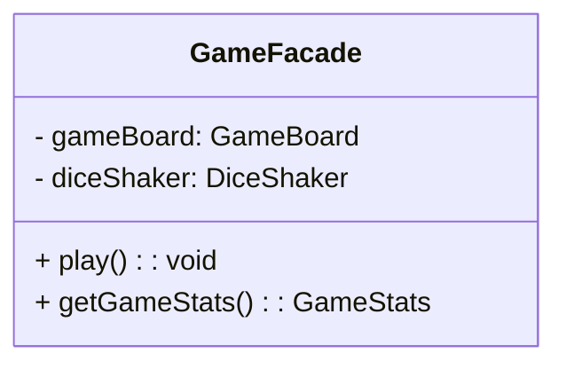
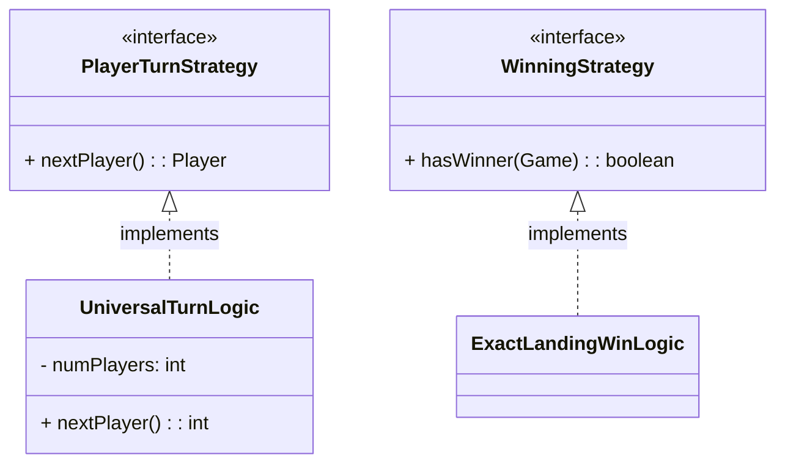
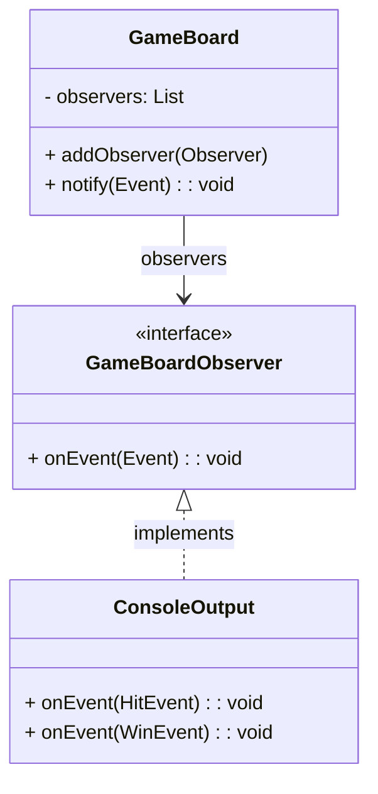
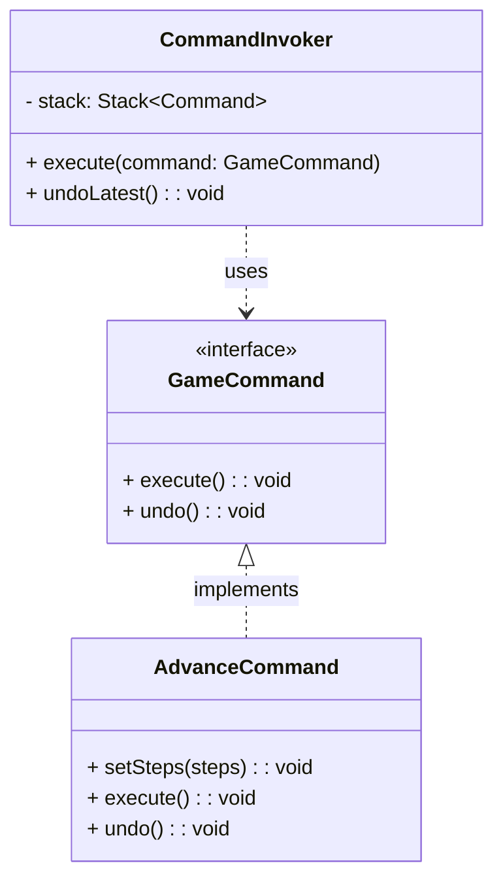
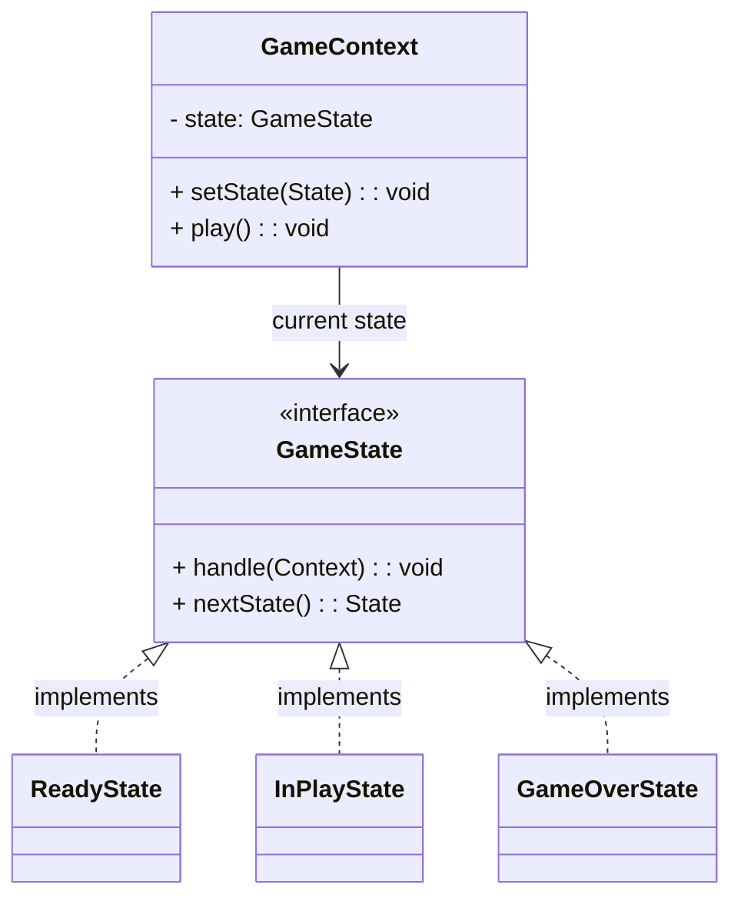
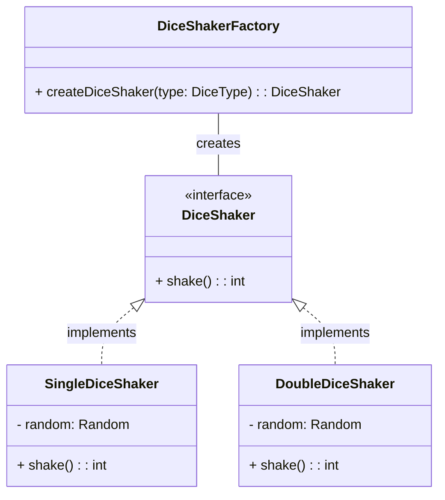
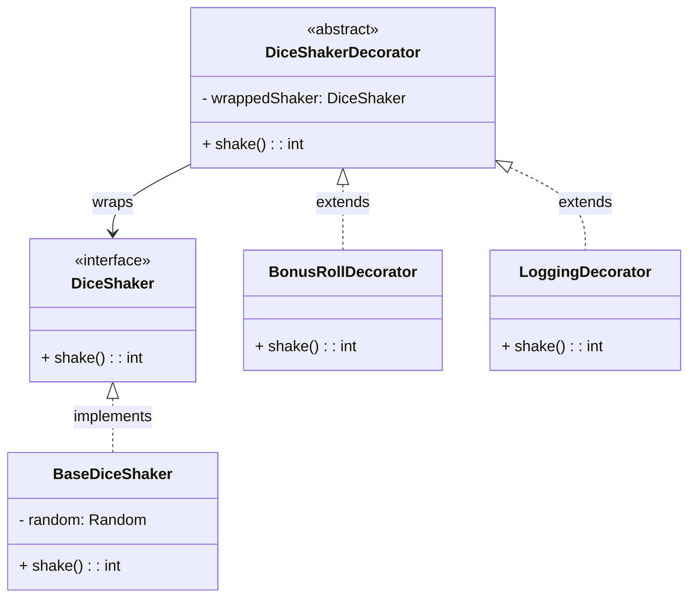
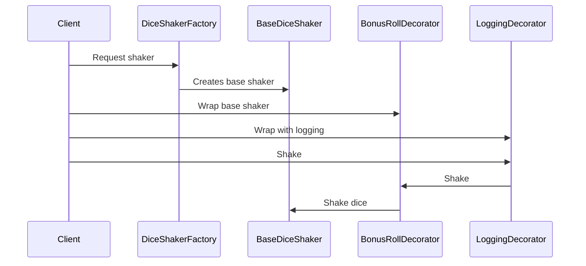

Certainly! Here are the class diagrams reformatted into Mermaid syntax. With these diagrams, you can visualize the design patterns more easily.

---

### 1. Façade Pattern

---

### 2. Strategy Pattern

---

### 3. Observer Pattern

---

### 4. Command Pattern

---

### 5. State Pattern

---

These diagrams give a clear and illustrative representation of the design. Let me know if you'd like to see refinements, or if you need help exporting these diagrams.

Great question! Both the Factory Pattern and the Decorator Pattern have their merits depending on the flexibility and the design goals for the dice shaker.

---

### 1. **Factory Pattern for Dice Shaker**
The Factory Pattern can be a great way to encapsulate the creation logic of the `DiceShaker` objects, especially if the creation involves multiple types of dice (e.g., single die, double dice, or custom dice with different sides). It gives you a centralized and extensible way to manage dice creation.

#### When to Use:
- If you want to separate the object creation logic for dice shakers.
- If you anticipate adding/removing different types of `DiceShaker` classes.
- If dice creation may differ based on configurations or runtime conditions.

##### Example Factory Implementation

In this example:
- The `DiceShakerFactory` creates instances of `DiceShaker` based on an input `DiceType` enum (e.g., SINGLE, DOUBLE, CUSTOM).
- If you introduce more dice types in the future, you only need to update the factory without modifying the consumers of `DiceShaker`.

---

### 2. **Decorator Pattern for Dice Shaker**
The Decorator Pattern is ideal if you want to dynamically add extra behavior to the dice shakers, such as:
- Modifying the dice roll results (e.g., adding a bonus roll, subtracting penalties).
- Logging rolls for debugging or analytics.
- Applying game-specific rules to the dice results.

#### When to Use:
- If you want flexible, runtime-modifiable behavior for dice rolls.
- If you need to dynamically stack behaviors (e.g., a penalty decorator + bonus decorator).

##### Example Decorator Implementation

In this example:
- `BonusRollDecorator` adds a bonus to the roll result.
- `LoggingDecorator` logs the result of the dice shake.
- You can stack these decorators dynamically, e.g., a dice shaker with both logging and bonus roll behaviors.

---

### Recommendation:
#### **When to Use Factory vs. Decorator**
- Use the **Factory Pattern** if the primary concern is **creating different types** of dice shakers based on static configurations or runtime input.
    - Example: A `SingleDiceShaker`, `DoubleDiceShaker`, or a custom `N-SidedDiceShaker`.
- Use the **Decorator Pattern** if the dice shakers share the same core behavior but can have **additional, dynamic features or rules**.
    - Example: Applying game-specific modifiers to the roll values.

---

### Combined Usage
You can also combine the Factory and Decorator Patterns to great effect:
1. A factory creates the base `DiceShaker` instance.
2. Decorators are used to add dynamic behaviors to the `DiceShaker` at runtime.

#### Workflow Example
1. The `DiceShakerFactory` creates a `SingleDiceShaker`.
2. A `BonusRollDecorator` wraps the `SingleDiceShaker` to add a bonus.
3. A `LoggingDecorator` wraps the decorated shaker to log the rolls.

This approach provides flexibility and scalability for dice shakers in your system while adhering to good software design principles. Let me know if you'd like more concrete code examples!