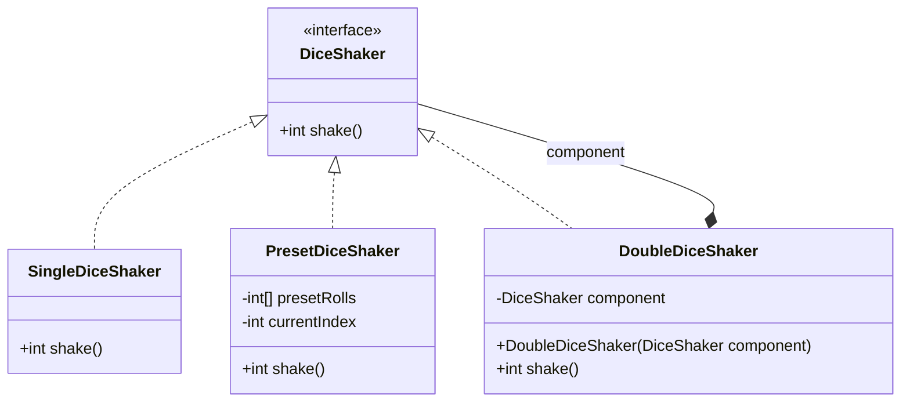
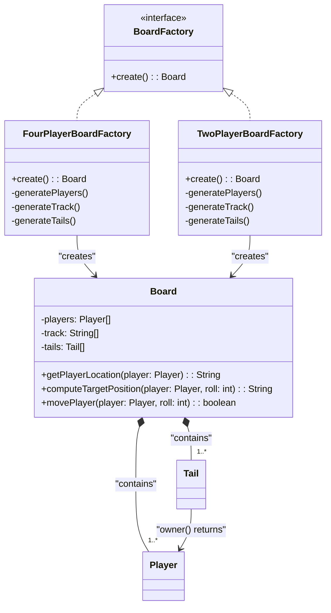
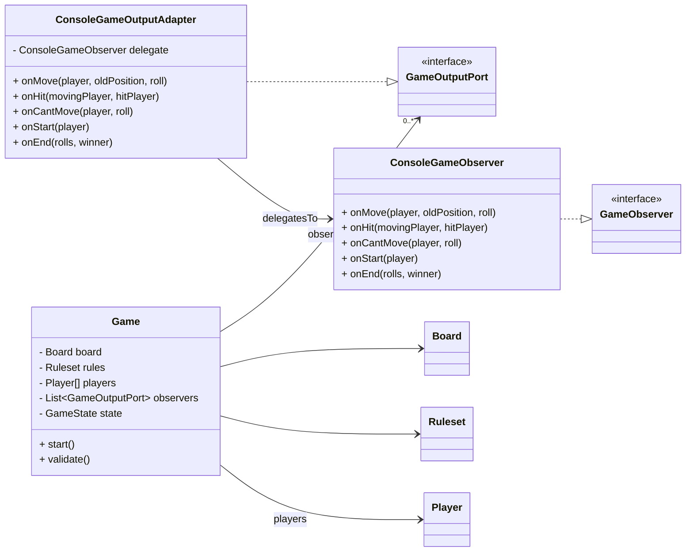
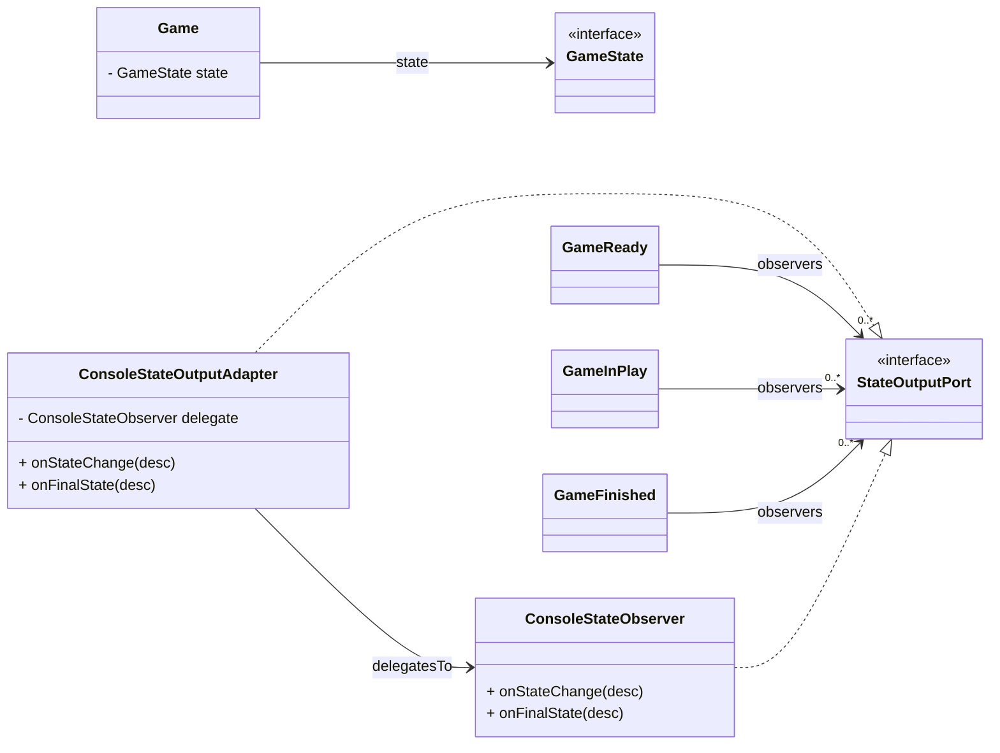

# Software Design & Architecture | 6G5Z0059 1CWK100

## Metadata
- **Written with**: `Oracle OpenJDK 25`
- **Requires**: `Spring Boot >=4.0.0`
- **Package Manager**: `Maven`

## Authors

- **James Nash** - *Student @ MMU* - [GitHub Profile](https://github.com/jamesn1208)

## Table of Contents

- [Introduction](#introduction)
- [Design Patterns](#design-patterns)
    - [Decorator Pattern](#decorator-pattern)
    - [Factory Pattern](#factory-pattern)
    - [Observer Pattern](#observer-pattern)
    - [Facade Pattern](#facade-pattern)
- [Principles of Software Design](#principles-of-software-design)
    - [SOLID Principles](#solid-principles)
    - [DRY Principle](#dry-principle)
    - [Dependency Injection](#dependency-injection)
    - [Inversion of Control](#inversion-of-control)
- [Architectural Styles](#architectural-styles)
    - [Clean Architecture](#clean-architecture)
    - [Ports and Adapters Architecture](#ports-and-adapters-architecture)
- [Advanced Features](#advanced-features)
    - [State Machines](#state-machines)
    - [Four Players](#four-players)
    - [Game Rule Variations](#game-rule-variations)
- [Notes](#notes)
- [Conclusion](#conclusion)

## Introduction

The purpose of this document is to provide an overview of where each concept has been used in my program. This means
that I am not going to explain the concept itself, instead showing where it's used and why I chose to use it there.

## Design Patterns

The following are the design patterns that have been implemented within my program.

### Decorator Pattern

I chose to implement the Decorator Pattern within my program to handle the different types of dice shakers. This allows
for easy extension of new dice shaker types in the future, as well as allowing for combinations of different
functionality (e.g. a preset dice shaker that rolls two dice, or a die that impacts previous rolls (like double or half
etc.)). I think that the dice use case is ideal for this pattern, as many board games tend to 'invent' new types of die
to add variety to gameplay. This allows the program to easily adapt to these new types without needing to modify
existing code.

This also helped me create the `PresetDiceShaker` class, which is used for 'replaying' a game with a known set of rolls.
So long as you provide the same game setup (rules, board and players), you will get the same outcome every time.
Otherwise, the `Game` class would need to have a variation to accept a list of rolls, which would violate the Single
Responsibility Principle (part of SOLID).

Here is a class diagram illustrating my Decorator Pattern implementation:

### Factory Pattern

I chose to make use of the Factory Pattern within my program to handle the creation of different types of game boards.
This allows for easy expansion in the future if new types of boards are to be added, as well as keeping the board
creation logic separate from the rest of the program. The main purpose of this is to alleviate the difficulty of
creating a `Board` object, which otherwise would require the user to specify an array of players, track positions and
tails. I could also achieve a very similar outcome using the Facade pattern, however I felt that the Factory Pattern
was more appropriate here as it is specifically concerned with `Board` object creation.

Here is a class diagram illustrating my Factory Pattern implementation:

### Observer Pattern

I implemented the Observer Pattern within my program to handle game state changes and game events. This allows for
loose coupling between the game logic and the output/display logic, as well as allowing for easy extension in the future
if new types of observers are to be added (e.g. a REST observer). This also adheres to the Dependency Inversion
Principle (part of SOLID), as the high-level `Game` class does not depend on low-level output classes, but rather on
abstractions (interfaces).

This also helps me to move my logging logic away from the business logic of the game, adhering to the Single
Responsibility Principle (part of SOLID). The `Game` class is only concerned with the game logic, while the observers
are solely concerned with outputting the game state and events. This would allow for something else to observe these
events in the future, such as a GUI or web interface without needing to edit any concrete game logic.

I chose to implement it in two parts: one for game events (e.g. moves, hits, game start/end) and one for game state
changes (e.g. ready, in play, finished). This allows for a clear separation of concerns, as well as allowing for
different types of observers to be used for different purposes. For example, a console observer might be used for
game events, while a GUI observer might be used for game state changes.

Here are two diagrams illustrating my Observer Pattern implementation:

**ConsoleGameObserver**

**ConsoleStateObserver**

### Facade Pattern
I have abstracted the difficulty of creating two different types of game, `RandomGame` and `ReplayGame`, behind simple
facade classes `RandomGameFacade` and `ReplayGameFacade`. This allows for easy creation of these game types, where less
complex data is provided, and the difficulty is abstracted away from the user. This also adheres to the Single
Responsibility Principle (part of SOLID), as the facade classes are only concerned with creating the game objects, while 
the `Game` class is only concerned with the game logic. These facade classes allow me to have just one `Game` class
because the way in which the class is written would make it difficult to create both types of game without prior
knowledge of how to set it up. They are set up using overloaded constructors that accept different parameters depending 
on the type of game being created. This allows for default parameters to be used where necessary, such as making it so
you don't have to provide a list of observers, so long as you want it to use the console observers. This could be
expanded in the future for other types of games if needed.

## Principles of Software Design

The following are the principles of software design that have been implemented within my program.

### SOLID Principles

I have made a conscious effort to adhere to the SOLID principles of software design throughout my program. This
includes:

- **Single Responsibility Principle**: Each class has a single responsibility and is only concerned with one aspect of
  the program. For example, the `Game` class is only concerned with the game logic, while the `ConsoleGameObserver`
  class is only concerned with outputting game events to the console.
- **Open/Closed Principle**: Classes are open for extension but closed for modification. For example, the `DiceShaker`
  interface allows for new types of dice shakers to be added without modifying existing code.
- **Liskov Substitution Principle**: Subtypes can be substituted for their base types without altering the correctness
  of the program. For example, any class that implements the `GameOutputPort` interface can be used in place of another.
- **Interface Segregation Principle**: Clients should not be forced to depend on interfaces they do not use. For
  example, the `GameOutputPort` interface is separate from the `StateOutputPort` interface, allowing clients to only 
  depend on the interfaces they need.
- **Dependency Inversion Principle**: High-level modules should not depend on low-level modules; both should depend on
  abstractions. For example, the `Game` class depends on the `GameOutputPort` interface rather than concrete output
  classes.

### DRY Principle

I have strived to adhere to the DRY (Don't Repeat Yourself) principle throughout my program. This means that I have
avoided duplicating code wherever possible; instead opting to create reusable components and functions. For example, the
`Board` class contains methods `getPlayerLocation`, `computeTargetPosition` and `movePlayer` which do very similar tasks
but are used in different contexts. Due to this, I created the `findOwnedTail` & `computeTailEntryFromTrack` methods
that are called by each of the aforementioned methods to avoid duplicating the logic.

### Dependency Injection

I am making use of Spring Framework's Dependency Injection (DI) capabilities to manage the dependencies between classes
in my project. This allows for loose coupling between classes, as well as making it easier to test and maintain the 
code. For example, the `Game` class depends on the `Board`, `Ruleset`, `DiceShaker` and `GameOutputPort` interfaces, 
which are injected into the class via its constructor. This allows for different implementations of these interfaces to 
be used without modifying the `Game` class itself. I have created several `Bean` configuration classes to define how 
these dependencies should be resolved at runtime, and also several `Component` classes to allow Spring to automatically
detect and register them as beans.

### Inversion of Control

I have implemented Inversion of Control (IoC) in my program by using the Spring Framework to manage the lifecycle of
my objects. This means that the control of object creation and management is inverted from the traditional approach,
where the objects themselves are responsible for their own creation and management. Instead, the Spring Framework
takes care of this, allowing for loose coupling between classes and making it easier to test and maintain the code. For
example, the `Game` class does not create its own dependencies; instead, they are injected into the class via its
constructor by the Spring Framework.

## Architectural Styles

The following are the architectural styles that have been implemented within my program.

### Clean Architecture

I have designed my program following the principles of Clean Architecture, which emphasises the separation of concerns
and the independence of the core business logic from external frameworks and technologies. This means that the core
business logic of the game is encapsulated within the `Game`, `Board`, `Player`, and `Ruleset` classes, while the
external frameworks and technologies (e.g. Spring Framework, console output) are kept separate from this core logic.
This allows for easy testing and maintenance of the core logic, as well as making it easier to adapt the program to
different frameworks and technologies in the future. The core business logic does not depend on any external frameworks 
or technologies, but rather on interfaces.

This means that if I were to switch from a console-based output to a GUI-based output, I would only need to create new 
observer implementations without needing to modify the core business logic of the game. This mitigates the risk of 
affecting existing functionality when making changes to the output mechanism. This also majorly aids in my adherence to
SOLID principles (SRP).

### Ports and Adapters Architecture

I have implemented the Ports and Adapters Architecture in my program to further enhance the separation of concerns and 
independence of the core business logic from external frameworks and technologies. This architecture style emphasises 
the use of 'ports' (interfaces) and 'adapters' (implementations of those interfaces) to connect the core business logic 
(application code) to the infrastructure. In my program, anything under the `/applicationcode` package is considered the 
business logic, while anything under the `/infrastructure` package is considered the infrastructure. 

The core business logic defines the 'ports' (interfaces) that it needs to interact with the infrastructure, while the 
infrastructure provides the 'adapters' (implementations of those interfaces) to connect to the core logic. For example, 
the `GameOutputPort` and `StateOutputPort` interfaces define the ports that the core business logic needs to interact 
with the output mechanism, while the `ConsoleGameOutputAdapter` and `ConsoleStateOutputAdapter` classes provide the 
adapters to connect to the console output mechanism.

This makes the program feel modular and almost hot-swappable in terms of its components, as I can easily swap out 
different adapters without needing to modify the core business logic. This also aids in my adherence to SOLID principles
(DIP, ISP, SRP).

## Advanced Features

The following are the advanced features that have been implemented within my program.

### State Machines

I have implemented a State Machine for my `Game` class to manage the different states of the game (`Ready`, `InPlay`, 
`Finished`). This allows for a clear separation of concerns between the different states of the game, as well as giving
me another opportunity to provide an Observer layer for future extensibility. Each state is represented by a separate 
class that implements the `GameState` interface, allowing for easy extension in the future if new states are to be 
added. The `Game` class maintains a reference to the current state and delegates state-specific behaviour to the
current state object. This also helps to enforce the rules of the game, as certain actions are only allowed in certain 
states. For example, the game loop only continues whilst the game is in the `InPlay` state (if you trigger the `start()` 
method again, it will not continue to loop). 

Each state class also has a `handle()` method, allowing for a state to perform any state specific actions when it is 
entered. For example, the `GameFinished` state triggers the final state observer notification when the `handle()` method
is called.

### Four Players

My program has an additional board factory called `FourPlayerBoardFactory`, which creates a game board for four players 
instead of the standard two. It works much the same way as the `TwoPlayerBoardFactory`, but generates four players, a 
longer track and more tails (one per person). This utilises the `BoardFactory` interface, adhering to the Factory 
Pattern previously discussed. This allows for easy extension in the future if new types of boards are to be added, as 
well as keeping the board creation logic separate from the rest of the program.

The logic is intentionally primitive as it allows for more complex design at a later date for the game engineers. As if
I were to use a dynamic approach, where you can enter a variable number of players, the logic for turn-taking and win
conditions would become more complex. This could lead to a violation of the Single Responsibility Principle (part of 
SOLID).

### Game Rule Variations

My program supports different game rule variations via their respective interfaces - `BaseHitCondition` and 
`BaseWinCondition`. This allows for easy extension in the future if new rule variations are to be added, as well as 
keeping the rule logic separate from the rest of the program. Currently, there are two versions of each condition:
- `StandardHitCondition`: A player can hit another player if they land on the same position.
- `VariationHitCondition`: Two players cannot occupy the same board tile, if a player would land on the same tile, it
  simply negates their turn.
- `StandardWinCondition`: A player wins by reaching the end (or past) of the track.
- `VariationWinCondition`: A player wins by reaching the exact end tile only. (if an overshoot occurs, the turn is 
  negated)

My rules are stored in a `Record` called `Ruleset`, which is a method of bundling similar data together. This allows for 
easier construction for the Factory classes, as well as making it easier to pass around the ruleset as a single object. 
This also adheres to the Single Responsibility Principle (part of SOLID), as the `Ruleset` class is only concerned with
storing the rules of the game. This would also allow me to add validation to the referenced data type in the future. For
example, to ensure that the hit and win conditions are compatible with each other, or a die shaker type is valid for the 
game.

## Notes
These are some additional notes on things that were too small / insignificant to have their own headers, but I still
believe are worth mentioning:

1. Used multiple types of Java object:
    - Interfaces
    - Classes
    - Records
    - Enums
2. The use of Enums with a private constructor to work as a type-safe constant. (`infrastructure.utils.Colours`)
3. The fact that my `Game` class is reliant on the `BaseGame` interface, allowing for easy swapping of different game 
   types in the future.

## Conclusion

In conclusion, I have implemented several design patterns, principles of software design, architectural styles, and
advanced features within my program. These implementations have allowed for a modular, extensible, and maintainable
codebase that adheres to best practices in software design. The use of design patterns such as the Decorator, Factory, 
and Observer patterns has allowed for easy extension and separation of concerns. The adherence to SOLID principles and 
the DRY principle has ensured that the code is clean and maintainable. The implementation of Clean Architecture and 
Ports and Adapters Architecture has further enhanced the separation of concerns and independence of the core business
logic. Finally, the advanced features such as State Machines, support for four players, and game rule variations have
added depth and flexibility to the game. Overall, these implementations have contributed to a well-designed and
robust program that is easy to understand, maintain, and extend in the future. 
